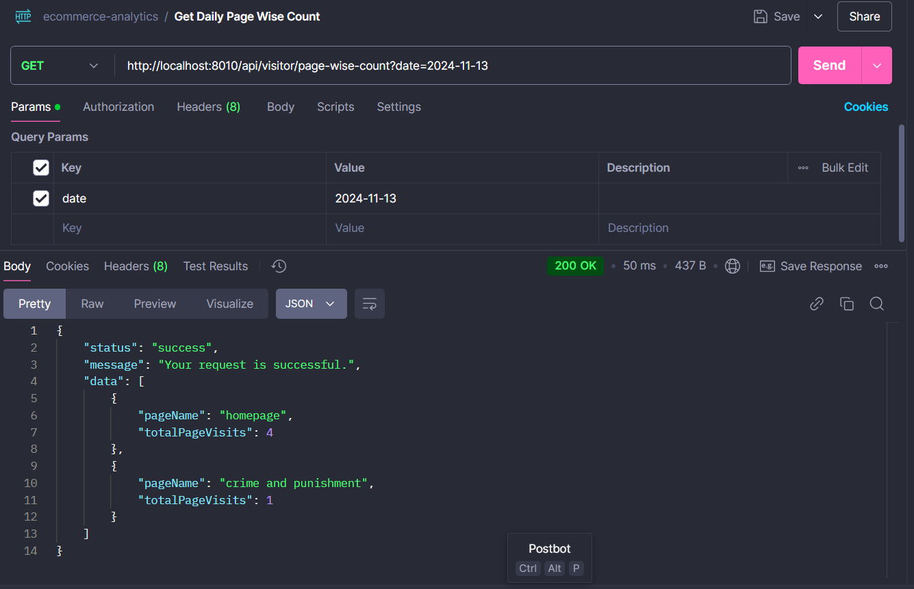
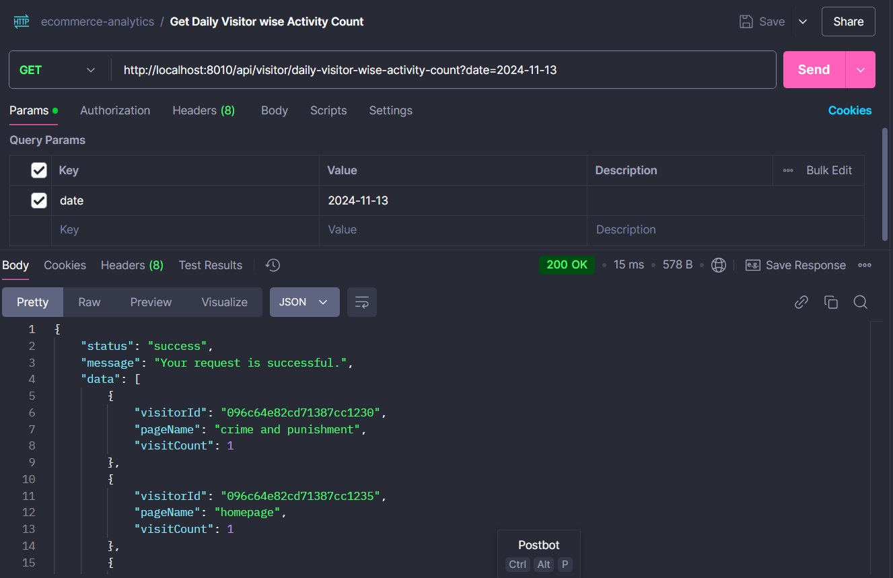
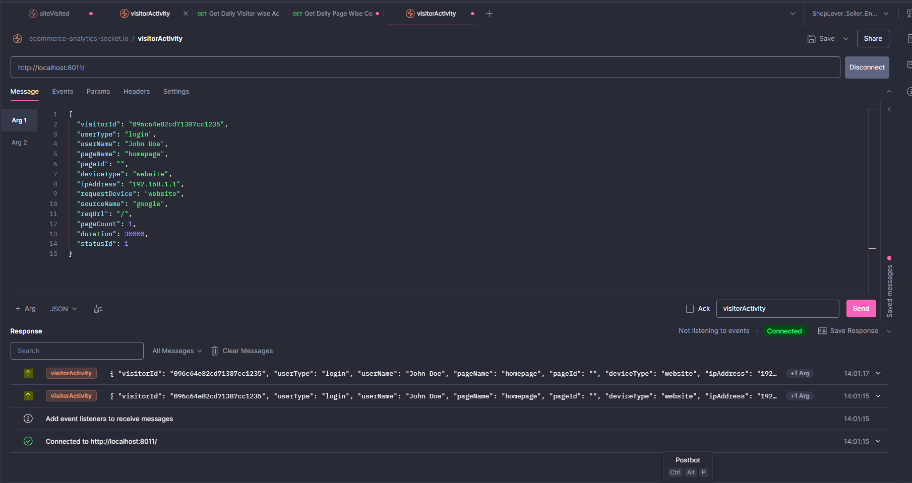

# ecommerce-analytics






Creating a **README.md** file for your **ecommerce-analytics** application involves providing essential information about the project, including its purpose, setup instructions, features, usage, and contributing guidelines. Here's a standard way to structure the **README.md** file for your application:

---

# Ecommerce Analytics

## Overview

Ecommerce Analytics is a robust application designed to track, record, and analyze visitor activity on an ecommerce website. It helps in tracking page visits, user interactions, and session data to provide insights into user behavior, popular products, and overall site performance. This tool is essential for ecommerce businesses to optimize their websites based on user engagement.

## Features

- **Visitor Tracking**: Records visitor activity such as page visits, session duration, and user type.
- **Page-wise Visitor Count**: Get the count of how many times each visitor has visited a page in a day.
- **Analytics**: View aggregated data on visitor activities to gain insights into user behavior.
- **Real-time Session Logging**: Tracks and logs each visitor's actions in real time.
- **Error Handling**: Centralized error handler for consistent API error responses.
- **Standardized API Responses**: API responses follow a consistent format for easy consumption.

## Technologies Used

- **Backend**: Node.js, Express.js
- **Database**: MongoDB
- **ORM**: Mongoose
- **Date/Time Handling**: Moment.js (timezone support for Asia/Dhaka)
- **Error Handling**: Centralized middleware for standardized error responses
- **Environment**: MongoDB Atlas (or local database)

## Installation

### Prerequisites

Before you begin, make sure you have the following installed:

- **Node.js** (>= 14.x.x)
- **MongoDB** (or a MongoDB Atlas account for cloud storage)

### Setup

1. Clone the repository:
   ```bash
   git clone https://github.com/your-username/ecommerce-analytics.git
   cd ecommerce-analytics
   ```

2. Install dependencies:
   ```bash
   npm install
   ```

3. Create a `.env` file in the root directory and add the following environment variables:
   ```bash
   MONGODB_URI=your_mongodb_connection_string
   PORT=5000
   ```

4. Run the application:
   ```bash
   npm start
   ```

   The application will start running on `http://localhost:5000` by default.

## API Endpoints

### 1. **Visitor Activity Tracking API**

#### **POST /api/visitor/activity**

- **Description**: Tracks visitor activity for a specific page and logs session data.
- **Request Body**:
  ```json
  {
    "visitorId": "12345",
    "userName": "John Doe",
    "pageId": "abcd1234",
    "deviceType": "mobile",
    "ipAddress": "192.168.1.1",
    "requestDevice": "iPhone",
    "sourceName": "Google",
    "reqUrl": "/product/xyz",
    "duration": 120,
    "userType": "guest",
    "pageName": "Product XYZ"
  }
  ```

- **Response**:
  ```json
  {
    "status": "new",
    "message": "New visitor log created"
  }
  ```

---

### 2. **Get Page-wise Visitor Count API**

#### **GET /api/visitor/analytics**

- **Description**: Retrieves the count of visitors per page for a specific day.
- **Query Parameters**:
  - `date`: The date in `YYYY-MM-DD` format for which you want to retrieve the data.
  
- **Example Request**:
  ```
  GET /api/visitor/analytics?date=2024-11-14
  ```

- **Response**:
  ```json
  {
    "status": "success",
    "data": [
      {
        "pageName": "Crime & Punishment",
        "visitorCount": 150
      },
      {
        "pageName": "The Alchemist",
        "visitorCount": 1000
      },
      {
        "pageName": "Sesher Kabita",
        "visitorCount": 560
      }
    ]
  }
  ```

---

## Error Handling

The application uses a **centralized error handler** to ensure consistent error responses across the API. Errors are returned in the following format:

```json
{
  "status": "error",
  "message": "Error description here",
  "error": "Detailed error information here"
}
```

For unhandled errors, the response will return a **500 Internal Server Error**.

---

## Contributing

We welcome contributions! Please follow these steps to contribute:

1. Fork the repository.
2. Clone your fork to your local machine:
   ```bash
   git clone https://github.com/your-username/ecommerce-analytics.git
   ```
3. Create a feature branch:
   ```bash
   git checkout -b feature-name
   ```
4. Make your changes.
5. Commit your changes with a descriptive message:
   ```bash
   git commit -m "add: new feature for visitor tracking"
   ```
6. Push to your fork:
   ```bash
   git push origin feature-name
   ```
7. Open a pull request.

---

## Testing

To ensure the quality of the application, run the tests using:

```bash
npm test
```

Make sure all tests pass before submitting a pull request.

---

## License

This project is licensed under the MIT License - see the [LICENSE](LICENSE) file for details.

---

### Additional Information

For more information on usage, configuration, and extending the application, please check the official documentation or contact the project maintainers.

---

### Notes

1. **Customization**: The application is flexible and can be customized to track additional user activities and analytics by extending the schema and API endpoints.
2. **Deployment**: To deploy the application to production, consider using services like Heroku, AWS, or DigitalOcean with environment variables set up for MongoDB and other configurations.

---

This structure ensures that the **README.md** provides all the necessary information for setting up, using, and contributing to the **ecommerce-analytics** application in a standardized way.